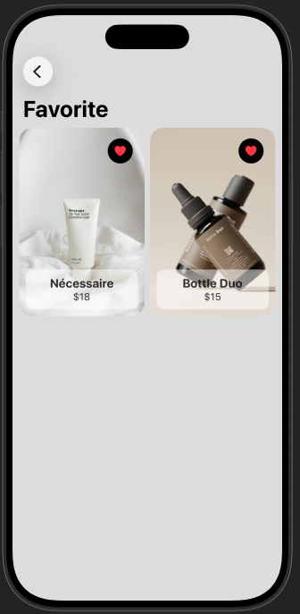

# Online Shop

A simple iOS e-commerce app where users can browse products and save their favorites.

## Features

- Browse products in the main catalog
- Add and remove items from favorites

## Screenshots

<p>
  
  
</p>

## Tech Stack

- **SwiftUI** — UI framework
- **Firebase** — backend & data storage
- **MVVM** — architectural pattern

## Project Structure

```
Online Shop/
├── Model/               # Data models
├── ViewModel/           # Business logic
├── mainScreen/          # Main product listing
├── FavoritesScreen/     # Favorites functionality
└── Views/FavoritesScreen/
```

## Requirements

- iOS 16+
- Xcode 15+

## Setup

1. Clone the repository
2. Add your own `GoogleService-Info.plist` from [Firebase Console](https://console.firebase.google.com)
3. Open `Online Shop.xcodeproj` in Xcode
4. Build and run

> `GoogleService-Info.plist` is not included in this repository for security reasons.

## Author

[Dmytro Listenin](https://github.com/DmytroListenin98)
